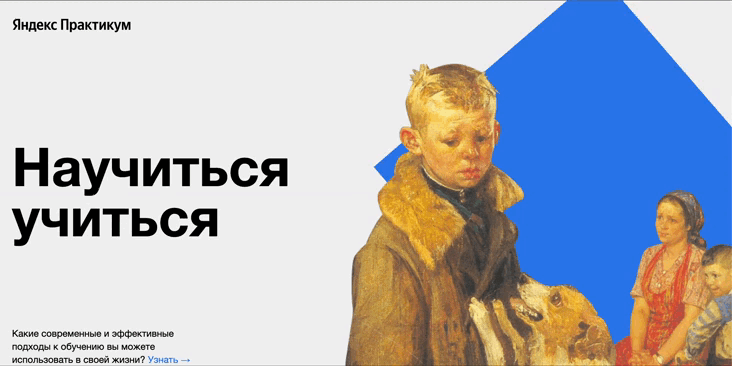

#Научиться учиться

***
#### - Введение:
***
Наш проект своего рода скрипт для желающих освоить новую тему, получить новые знания. Это не просто проект, это четкий план действий для обучающегося чему угодно.
Проект подсказывает вам, как сформировать процесс получения знаний. Здесь вы найдёте разные техники, методы и практики, которые сможете взять для себя за основу. Получите ссылки на источники лайфхаков в обучении. Ну и естественно после продуктивного труда нужно немного отдохнуть. В нашем проекте вы познакомитесь с героями роликов TED, которые научат вас прокрастинировать с пользой!
***
#### - Применение:
***
1. Одностраничный сайт создан при помощи HTML и CSS.
2. В проекте используются фрэймы, транформация и анимация.

`Вот пример кода анимации:`
```css
       @keyframes rotation {
       from {
       transform: rotate(0deg);
        }
       to {
       transform: rotate(360deg);
        }
       }

       .rotation {
        animation: rotation 20s linear infinite;
        }
```
3. Проект выполнен адаптивной версткой с использованием flex-контейнеров и flex-элементов.
4. Анимации реализованы через @keyframes, для вставки видео используется iframe.
5. Для формирования отступов между блоками на белом фоне и для запуска анимации применены миксы.
6. В коде присутствуют вариации оформления нестандартных отступов - псевдоклассы :last-child и :nth-child(), gap.
7. Все ссылки в проекте кликабельны, им задано состояние при наведении указателя мыши :hover.
8. В коде проекта создана Nested файловая структура.
***
#### -  Планы на проект
***
1. На всей странице сделать линейный градиент от светло-серого к черному.
2. В целом добавить проекту больше анимации и интерактивности.
3. Блок header:  доработать анимацию - квадрат должен катиться слева на право при наведении указателя мыши на страницу. В неактивном состоянии квадрат находится за главной иллюстрацией.
4. Блок techniques: блок cards__image при наведении указателя мыши применить transform: scale для увеличения объекта.
5. Блок feynman:  блок feynman__image применить трансформацию transform: skew, чтобы при просмотре блока feynman, его портрет смотрел еще выше (будто заглядывал в будущее)
6. Блок khan: блоку khan__book-pic добавить анимацию пульсацию во время просмотра блока, для создания ощущения, что книга стучится к пользователю.
7. Под блоком resources добавить блок foarm с полями, где пользователи могут  изменять стиль страницы под себя (размер текста, стиль шрифта, цвет), оставлять комментарий, делиться ссылками на свои источники, написать автору.
